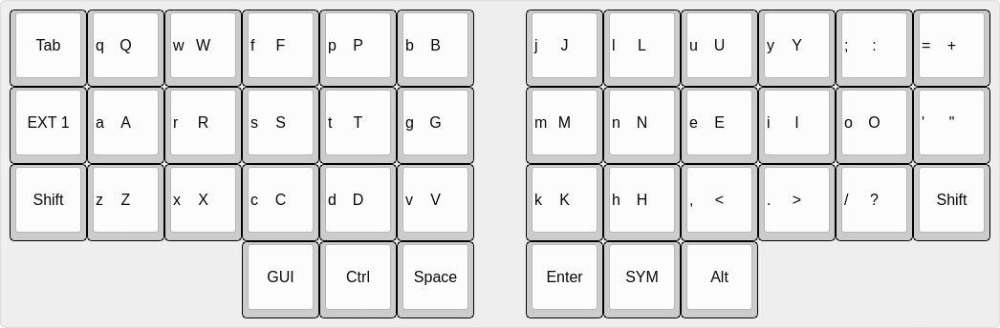
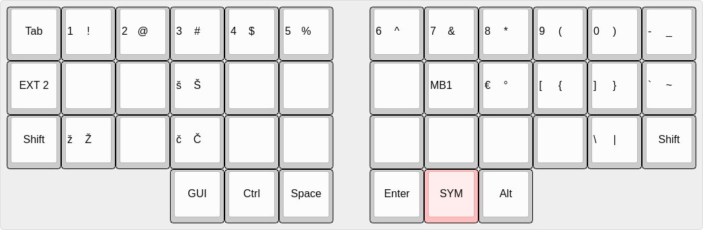
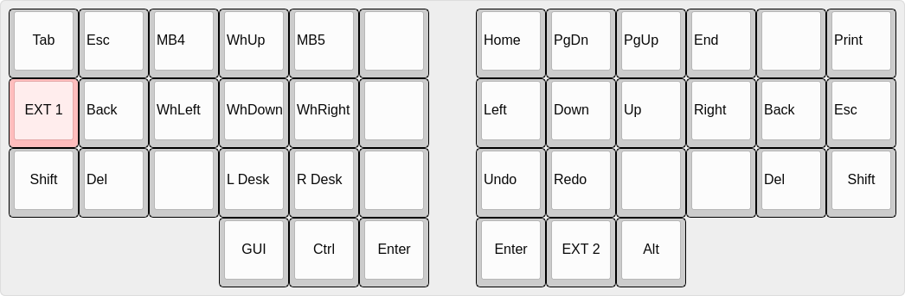
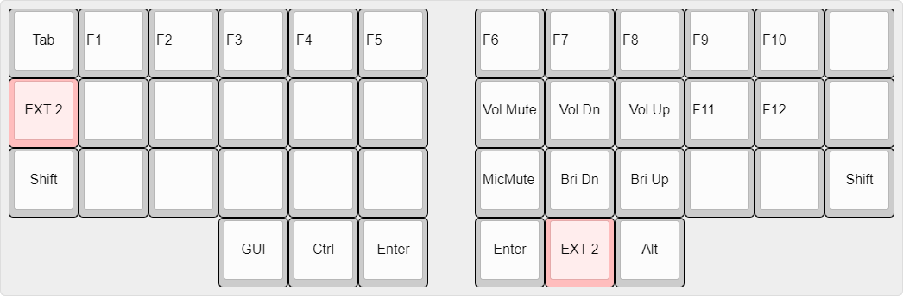
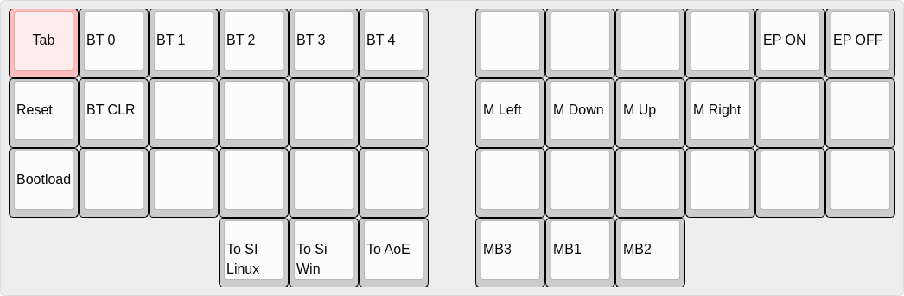

=======================
Custom ZMK Corne keymap
=======================

:Info: Custom ZMK Corne keymap

:Authors:
    Bzgec

.. contents:: Table of Contents
   :depth: 2

My Slovenian Colemak-DH angle mode
==================================

- Double tab on `SHIFT` key toggles `CAPS_LOCK`
- `Extend 2 layer`_ layer is accessible when pressing: `EXT1 + SYM`
- `ZMK layer`_ is accessible when holding `TAB` key
- Difference between "SI Linux" and "SI Windows" is in how a few special characters
  are implemented but for the end use there should be no difference

  - `si_n6_lin`    -> `si_n6_win` (`^`)
  - `si_grave_lin` -> `si_grave_win` (`\``, `~`)

Base layout
-----------

Symbols layout
--------------

Extend 1 layer
--------------

Extend 2 layer
--------------

ZMK layer
---------

- `BT 0-4`: Select the x bluetooth profile
- `BT CLR`: Clear bond between the keyboard and the host for the selected profile
- `Reset`: Reset this side of the keyboard
- `Bootl`: Reset this side of the keyboard to bootloader mode
- `EP ON`: Enable external power (enable VCC power output)
- `EP OFF`: Disable external power (disable VCC power output)
- `To US`: Switch keyboard layout to match US host layout
- `To SI Linux`: Switch keyboard layout to match SI host layout, Linux host
- `To SI Win`: Switch keyboard layout to match SI host layout, Windows host

Other
=====

- Nice keymap from `kkga`: `<https://github.com/kkga/zmk-config>`__

- Images were generated with `keyboard-layout-editor.com <http://www.keyboard-layout-editor.com/#/>`__.
  You can upload `<base-layer-keyboard-layout-editor.com.json>`__ to start editing from the above
  layout.
